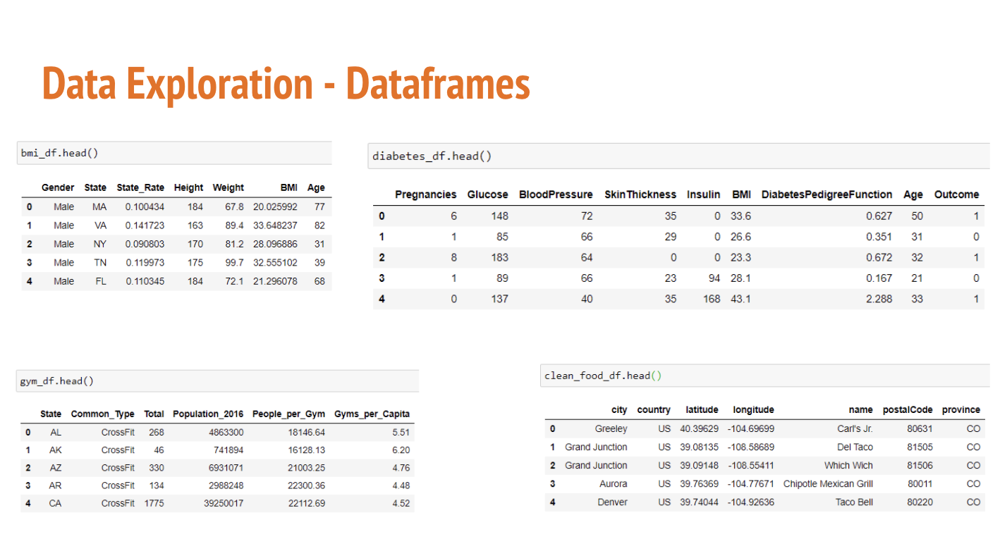

# Group 10 Final Project - Predicting Diabetes

# Overview

This repo fulfills the requirements for the final project for the Data Analytics & Visualization Bootcamp. The team was able to extract data from online sources, clean the data to increase usability, and then determine relationships from this data.  

The model we created is intended to be able to predict whether a patient has diabetes. This topic was chosen because many Americans are affected by diabetes in some form, and the ability to predict whether or not someone has it based on a few factors is valuable information to help understand the disease. 

Primarily, our biggest question was regarding which risk factor is the strongest predictor of diabetes. We want to know which ones correlate the strongest so we can add these features to our machine learning model and find out whether or not they are a good predictor. We also want to see how each of these risk factors correlate with each other, independent of diabetes.

According to “Factors that could explain the increasing prevalence of type 2 diabetes among adults in a Canadian province: a critical review and analysis,” some factors that contribute to diabetes are: Glucose levels, High blood pressure, Skin thickness, Insulin levels, BMI, Family history of diabetes, Age, and Number of pregnancies. 

After running models on this dataset, we also wanted to see any correlations with the number of fast food restaurants and gyms in the region.
## Related files
- PPT presentation: https://docs.google.com/presentation/d/1x6rKplWhXvLhmRE-Nq8vVQS1ZSTw0tYrL8jAP8YB5nE/edit#slide=id.gcc1bccc427_0_4
- Machine learning file: seg2_ml_model.ipynb
- Content for Tableau: csvs_for_tableau/tableau_df.csv, tableau_bins.ipynb

## Data Sources 

Primarily, our biggest question is determining which risk factor is the strongest predictor of diabetes. We want to know which ones correlate the strongest so we can add these features to our machine learning model and find out whether or not they are a good predictor. We also want to see how each of these risk factors correlate with each other, independent of diabetes.

Finding Data:

* Initial data found on CDC website (see ‘Lessons Learned’ for more info)
* Found data regarding # of gyms and fast food restaurants in US by state on various websites
* Needed to find other datasets to be able to join CDC data and gym/restaurant data (i.e. BMI data)
* After throwing out CDC data, found diabetes dataset on Kaggle

Cleaning Steps:

* Load all data sources into Jupyter Notebook as Pandas dataframes
* Check for null values 
* If any, delete rows
* Ensure data types are consistent, especially for numerical data
* Ensure columns with “State” information are in the same format
* Delete unnecessary columns
* Export to CSV 

# Database
* Database stores static data for use during the project
* Database interfaces with the project by connecting with our machine learning model

# Machine Learning Model

The code for our model can be found in the file: seg2_ml_model.ipynb. Luckily, for our model, we had a pretty clean dataset to work with (diabetes.csv), 
so there was very little pre-processing to take care of. 

Our main question when beginning this project was "What risk factors are the strongest indicators of diabetes?" Therefore, we decided to use each of the risk factors as the features of the model and running them against the outcome (diabetes or no diabetes).

There was data on 768 subjects so we had 768 rows of data. We decided to train the model with the first 650 subjects (our training set), while using the remaining 118 subjects to test the model (our testing set). The model uses the training set to learn from it then uses the testing dataset to assess the performance of the model.

We decided to use a logistic regression model because it primarily predicts binary outcomes (there are only two outcomes). In this case, the model will predict whether the subject has diabetes or does not have diabetes. It takes multiple variables to arrive at one of two destinations. It analyzes the available data, and when presented with new data, mathematically determines its probability of belonging to a class.

Benefits of Logistic Regression Models 
* It is easy to implement and interpret and is very efficient to train.
* It provides not only the measure of predictability, but also its direction of assocation (positive or negative).
* It is very fast at classifying unknown records
* It can interpret model coefficients as indicators of feature importance

Limitations of Logistic Regression Models
* It constructs linear boundaries
* There is an assumption of linearity between the dependent and independent variables.
* It is tough to obtain complex relationships using logistic regression. 

There was no change in model choice between Segment 2 and Segment 3. The model stayed the same, but we mis-identified the model we were using. In our last project write-up, we inaccurately stated that we used a Linear Regression model, when in fact, we were using a Logistic Regression model. 

As of right now, there is stll some work to do on the model, as it is very basic while still being pretty accurate. It would be helpful to specify a random state of 1 to ensure that the same rows are assigned to train and test each set. It would also be be helpful to stratify the dataset so we can be sure that the dataset is split proportionally. This will be included in the model for the final presentation and submission.

The accuracy score compares the actual outcome values from the test set against the model's predicted values and reflects the percentage of predictions that are correct.

Our current accuracy score is 78.81%, which is pretty good, but we are hoping the additions to the model will help make it more accurate.

# Dashboard
We plan to primarily use Tableau as our main visualization tool and to build the dashboard for the final project. The dashboard will have the option to toggle between different quartiles regarding fast food restaurants and gyms per capita, diabetes and BMI data. It will also have the ability to filter by average BMI by state.

Visualizations for the machine learning analysis were done in Python/Jupyter Notebook. Visualizations correlating features for the machine learning analysis were also done in Tableau. Visualizations comparing obesity, gyms and restaurants per captia were completed in Tableau. The Tableau Story is located here: https://public.tableau.com/profile/jennifer1946#!/vizhome/DiabetesFinalProject_16180665161890/Diabetes?publish=yes

## Data sources for visualization
- Obesity by state (2019, insufficient data for NJ)
- Diabetes by state (2020)
- Fast food Restaurants (2018)
- Gyms by state (2016)
- State and National Parks
## Calculated fields
- obesity/capita
- diabetes/capita
- restaurants/captia Calculations located in csvs_for_tableau.ipynb file.
## Bining
- To better show differences on the map, we binned the obesity/capita, restaurant/capita and gym/capita into bins based on quartiles from the describe() function. See tableau_bins jupyter notebook.

