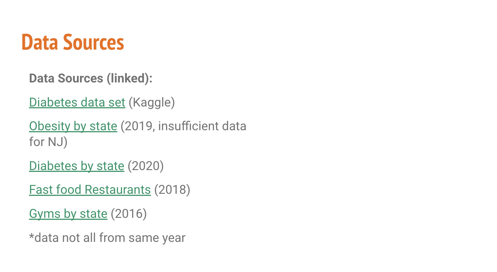
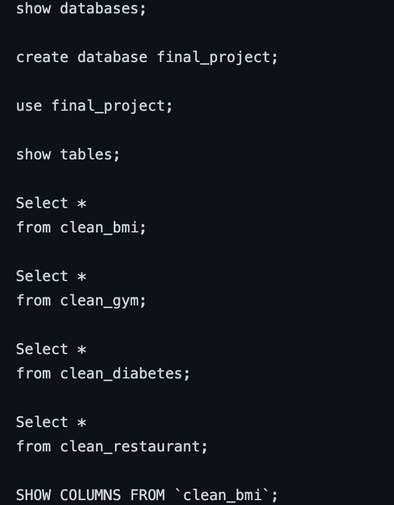

# Presentation

* Selected topic

For the purpose of this project, we have decided to analyze diabetes and it's associated risk factors in order to predict the likelihood of a diabetes diagnosis based on certain risk factors.

* Reason we selected this topic

We decided to analyze data pertaining to diabetes because we are interested in learning which risk factors are most effective in predicting a diabetes diagnosis. For this analysis, we found data for the following risk factors: 
** Pregnancy (amount of times pregnant)
** Glucose levels (plasma glucose concentration a 2 hours in an oral glucose tolerance test)
** Blood Pressure (Diastolic blood pressure (mm Hg))
** Skin Thickness (Triceps skin fold thickness (mm))
** Insulin levels (2-Hour serum insulin (mu U/ml))
** Body Mass Index
** Diabetes Pedigree Function (family history of diabetes)
** Age

## Source of data 

Primarily, our biggest question is "Which risk factor is the strongest predictor of diabetes?" We want to know which ones correlate the strongest so we can add these features to our machine learning model and find out whether or not they are a good predictor. We also want to see how each of these risk factors correlate with each other, independent of diabetes.

We are also interested in doing secondary analysis on the gym, fast food, and BMI data to see what kind of correlation there is. 

* Description of the data exploration phase of the project

* Description of the analysis phase of the project

* Presentation slides are drafted in Gooogle Slides

# GitHub
* All code necessary to perform exploratory analysis
* Some code necessary to complete the machine learning portion of the project
* README must include: 
       * Description of the communication protocols
       * Outline of the project (we must have this as a file stored in GitHub)

# Machine Learning Model

Luckily, for our model, we had a pretty clean dataset to work with. Our main question when beginning this project was "What risk factors are the strongest indicators of diabetes?" So we decided to use each of the risk factors as the features of the model and running them against the outcome (yes diabetes or no diabetes). 

There was data on 768 subjects so we had 768 rows of data. We decided to train the model with the first 650 subjects, while using the remaining 118 subjects to test the model. 

As a group, we decided to use a Linear Regression model. Linear Regression is a machine learning algorithm based on supervised learning. It performs a regression task. Regression models are target prediction value based on independent variables. It is mostly used for finding the relationship between variables and forecasting. This is the model we chose to use, while realizing it has its own advantages and disadvantages. We decided to use this model, ultimately, because the risk factors typically have a linear relationship with each other.

The main advantages of using linear regression is that it is easy to interpet the output coefficients and when you know the relationship between the independent and dependent variables have a linear relationship, it is the correct model to use because it's less complex than other models. While these advantages are great, there are limitations to this model, as well. For one, outliers can have a big effect on the regression model. Secondarily, the model automatically assumes there is a linear relationship present, which can be a problem if you don't know there is a relationship already. 

# Database
* Database stores static data for use during the project
* Database interfaces with the project in some format (e.g., scrpaing updates the database, or database connects to the model)
* includes at least two tables 
* includes at least one join using the database language 
* includes at leaast one connection string

# Dashboard
* storyboard on Google Slides
* Description of the tool(s) that will be used to create final dashboard
* Description of interactive element(s)

